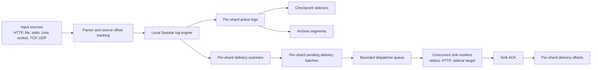
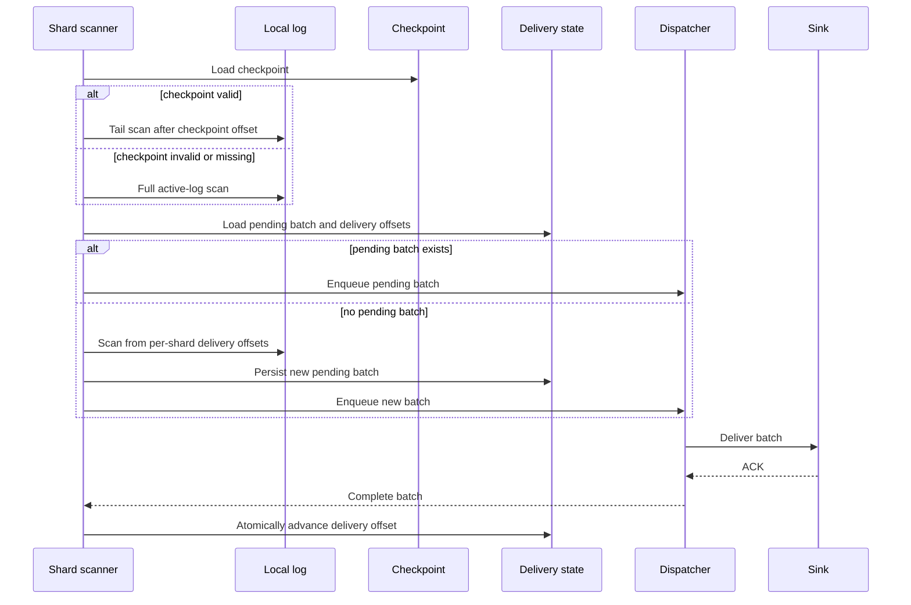

# Seastar Log Agent Architecture

This document describes the agent data path, recovery model, and delivery state boundaries.

## High-Level Data Flow



The key design choice is to acknowledge input only after the local engine accepts the record. Remote sink delivery is a second phase driven by local records and delivery offsets.

## Main Components

### Input Sources

Input sources normalize raw events into agent records:

- HTTP ingest accepts single records and `records` batches.
- File tail supports one file or glob expansion with per-file offsets.
- Stdin is useful for simple wrappers.
- Unix socket and TCP accept newline-delimited records with connection and message limits.
- UDP accepts best-effort newline-delimited records and reports drop counters.

Each record can carry an agent metadata envelope with `agent_id`, `source_id`, `source_offset`, `ingest_timestamp`, and `attributes`.

### Local Seastar Log Engine

The local engine uses Seastar's reactor and future model. Each shard owns its writer, pending queue, active log, and sequence space. Writes flow through:

```text
submit -> shard routing -> pending queue -> batch flush -> DMA-aligned append
```

The active log is append-only until rotate. Archives are read by the query and replay paths when `include_archive=true`.

### Checkpoint And Tail Scan Recovery

Checkpoint recovery is an acceleration and consistency hint, not the only source of truth:

1. The engine reads a checksummed v2 checkpoint sidecar if it exists.
2. If the checkpoint is valid, recovery starts from the checkpoint offset.
3. The engine scans the tail after the checkpoint and accepts valid records.
4. If the checkpoint is missing, stale, partial, or has a bad CRC, recovery falls back to a full active-log scan.
5. If a corrupted tail record is found, recovery stops at the last valid boundary.

This means records written after the checkpoint can still be recovered by tail scan, as long as their record frame and CRC are valid.

### Delivery Scanner

Remote delivery is driven by one scanner per shard and per-shard delivery offsets:

```text
local shard sequence -> query local records -> build batch -> persist shard pending batch
    -> bounded dispatcher queue -> sink worker -> ACK
```

Each scanner runs on its owning Seastar shard and keeps one in-flight batch, retry state, and offset. Pending and offset files use a shard suffix. A dispatcher on the control shard owns a bounded queue and a configurable number of asynchronous sink workers. The pending delivery batch is written before enqueueing. If the process crashes during delivery, restart reloads each shard's pending batch first. Delivery offset files are advanced only after the sink ACKs.

Plain active and archive segments are read through `open_file_dma` and
`make_file_input_stream`. Pending and offset files use asynchronous Seastar
streams plus temp-file rename and directory sync. Segment enumeration and gzip
decompression remain synchronous and should be measured separately when archive
counts or compressed history become large.

### Sink Boundary

The sink interface keeps remote delivery behind a small contract:

- `stdout` writes batches locally for demos and debugging.
- `http` sends idempotent JSON batches to a remote HTTP endpoint.
- `kafka` and `object_store` are sidecar strategies in this build.
- `none` disables remote delivery.

Every remote batch includes idempotency metadata so receivers can deduplicate replayed windows.

## State Files

Typical state files in the agent data directory:

```text
agent-logs/
agent-archive/
agent-source.offset
agent-delivery.offset.0
agent-delivery.offset.1
agent-delivery.pending.0
agent-delivery.pending.1
shard-0.log.checkpoint
```

`agent-source.offset` tracks how far file inputs have been consumed. Each `agent-delivery.offset.<shard>` tracks how far the remote sink has acknowledged that shard. Each `agent-delivery.pending.<shard>` stores the shard batch currently in the retry window. Legacy unsuffixed delivery files are migrated or used as initial offsets during upgrade.

## Restart Timeline



## Backpressure Path

Sources can pause when the agent detects pressure:

- local disk buffer exceeds high watermark.
- pending engine bytes are high.
- sink backlog grows.
- recent sink failures increase.
- sink latency or moving average latency exceeds threshold.

UDP cannot be paused reliably, so it may drop packets and increment drop counters. TCP, Unix socket, file, stdin, and HTTP paths can reject or pause work more predictably.

## Query And Replay Path

The query server and replay helper read the same active and archive segments. Query filters can use shard, sequence range, source id, and agent id. Replay can export records in sink batch format so an operator can recover unacknowledged local data without running the live sink loop.

## Operational Boundaries

The local engine is the durability boundary for accepted input. The remote sink is an at-least-once delivery boundary. Exactly-once effects require the downstream sink to deduplicate by agent and sequence metadata.
